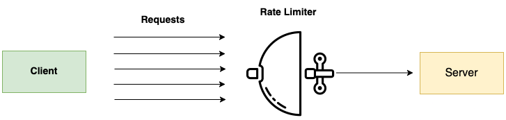
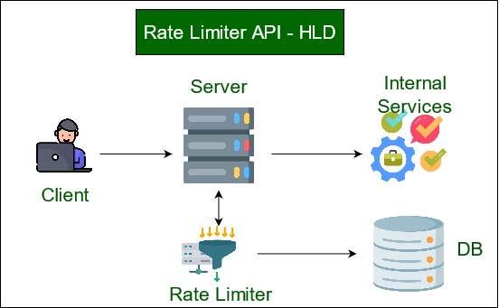
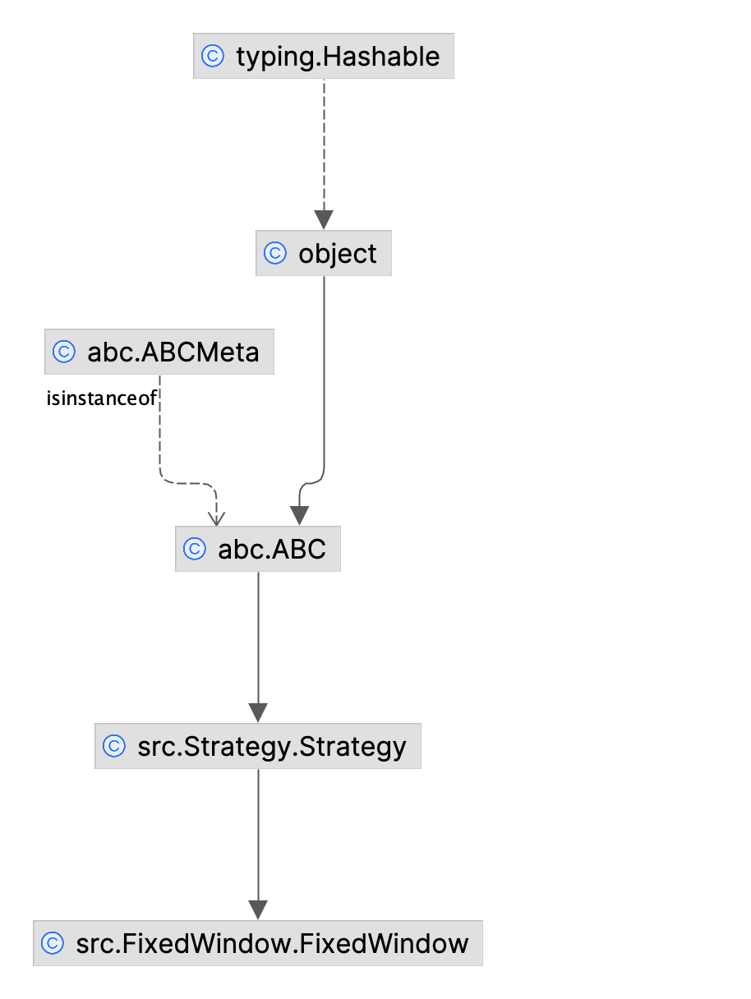
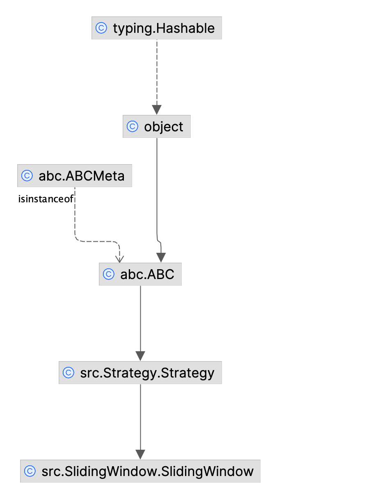
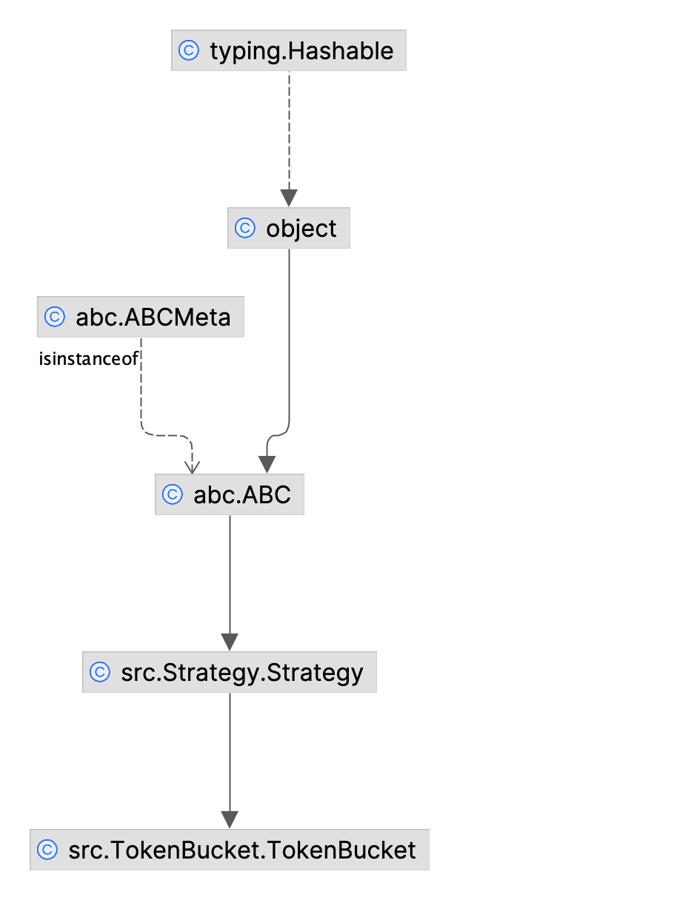

#### Rate Limiters

We need to support 3 different plans:

● Pro - 10 requests per second - total of 12,000 requests per day

● Enterprise - 100 requests per second - unlimited requests per day

● Free - allow 1 request per second - total of 50 requests per day

Assumptions:

1. Could not get access to the server, will implement simple Flask microservice
2. Use Redis as caching, use Docker
3. Renew each 24 hours

#### Design



#### HLD




#### Class Diagram - FixedWindow




#### Class diagram - SlidingWindow



#### Class diagram - TokenBucket




#### How to build

Step 1: create virtual env

```
python3 -m venv activefence_vent
```

Step 2: activate venv

```
source activefence_vent/bin/activate
```

Step 3:

```
python3 -m pip install --upgrade build
python3 -m build
```

#### Redis as memory storage

```
docker run -p 6379:6379 --name redis-rate-limiter -d redis
```

#### Why Redis:

* In-memory Data Store: Redis stores data in memory, making it extremely fast for read and write operations, making it 
  an ideal candidate for time-sensitive rate limiting.
* Atomic Operations: Redis supports atomic operations, allowing developers to perform multiple operations as a single, 
  atomic unit. This feature is crucial for maintaining consistency during rate limiting.
* Flexible Data Structures: Redis provides various data structures like lists, sets, and sorted sets

#### Why yaml

* Easy to read and write
* Supports comments (unlike JSON)
* Great for hierarchical data
* Widely supported in many programming languages


#### Run tests

```
pytest tests/*.py --no-header -s
```

#### How to scale
 
[scale redis](https://redis.io/docs/latest/operate/oss_and_stack/management/scaling/)


#### Send requests using curl

First start flask app locally

```
cd src
flask --app Jokefier run
```

Then send curl commands

```
curl --header "X-App-Id: ENTERPRISE_user"  'http://127.0.0.1:5000/jokes/chuck_norris'
```

```
curl --header "X-App-Id: FREE_user"  'http://127.0.0.1:5000/jokes/chuck_norris'
```

```
curl --header "X-App-Id: PRO_user"  'http://127.0.0.1:5000/jokes/chuck_norris' 
```


References:

[Redis](https://pypi.org/project/redis/)

[Redis commands](https://redis.io/docs/latest/commands/)

[](https://blog.finxter.com/5-best-ways-to-implement-rate-limiting-for-users-in-python/)

[](https://collabnix.com/rate-limiting-in-redis-explained/)

[rate limiting best practices](https://developer.okta.com/docs/reference/rl-best-practices/)

[unix timestamp calculator](https://www.unixtimestamp.com/)

